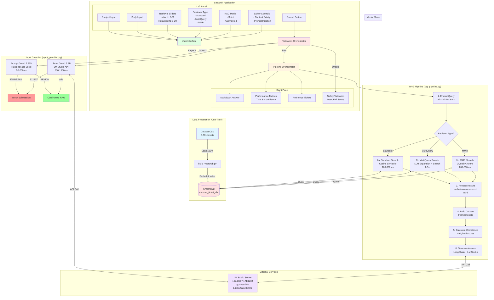
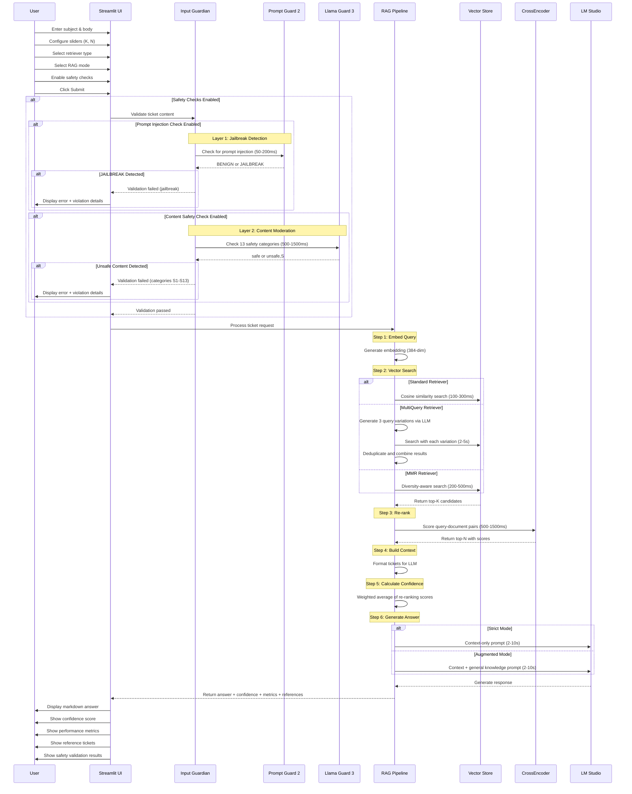
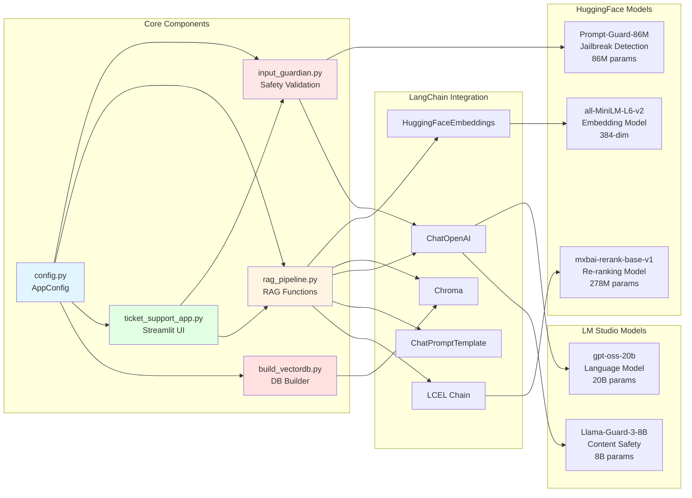
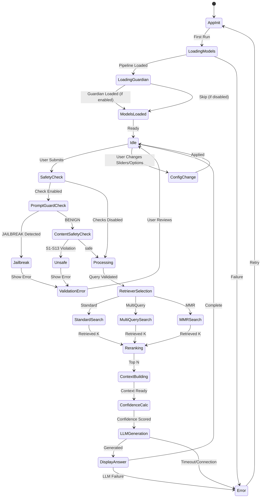
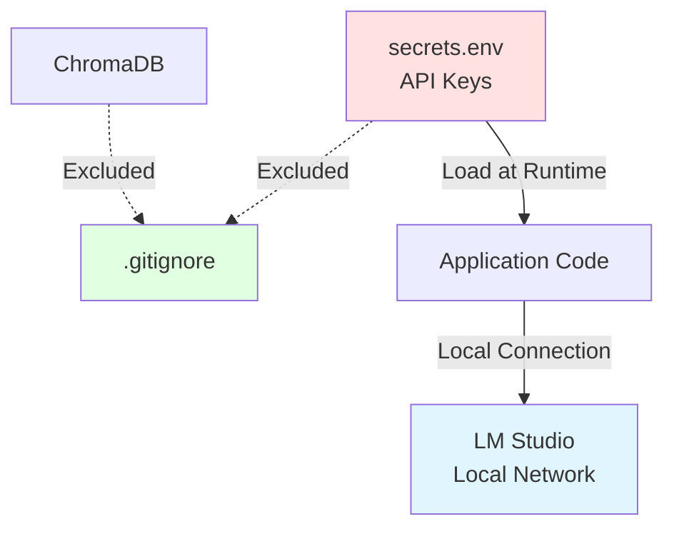
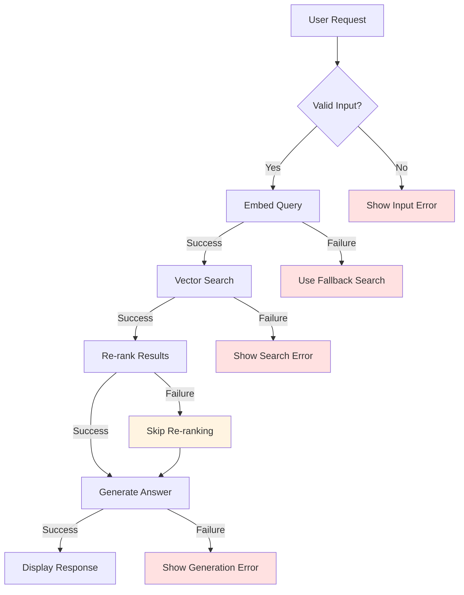
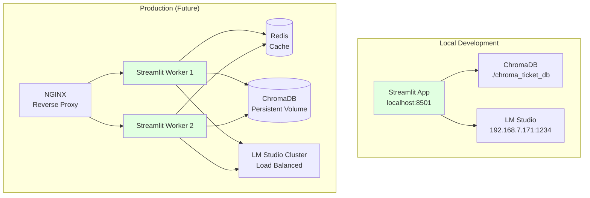

# Week07 RAG System - Technical Architecture

## System Architecture Diagram



## Data Flow Sequence



## Component Architecture



## State Management



## File Organization

```
Week07/
│
├── 📄 Documentation
│   ├── ARCHITECTURE.md                 # Architecture diagrams (this file)
│   ├── README.md                       # User documentation
│   └── Week07_Presentation.md          # Classroom presentation slides
│
├── 🐍 Core Application Files (Fully Documented)
│   ├── config.py                       # Configuration management
│   ├── input_guardian.py               # Dual-layer safety validation
│   │                                   # - Llama Guard 3 8B (content safety)
│   │                                   # - Prompt Guard 2 86M (jailbreak detection)
│   ├── rag_pipeline.py                 # RAG pipeline implementation
│   │                                   # - Three retriever strategies
│   │                                   # - Two-stage retrieval
│   │                                   # - LangChain LCEL integration
│   ├── ticket_support_app.py           # Streamlit UI application
│   │                                   # - Two-column layout
│   │                                   # - Configuration sliders
│   │                                   # - Safety controls
│   └── build_vectordb.py               # Vector DB builder script
│
├── 📦 Dependencies
│   ├── requirements.txt                # Python packages
│   └── secrets.env                     # API keys (gitignored)
│
├── 💾 Data Files
│   ├── dataset-tickets-multi-lang3-4k-translated-all.csv
│   ├── dataset-tickets-multi-lang3-4k.csv
│   └── chroma_ticket_db/               # Vector database (gitignored)
│
├── 📓 Notebooks (Reference - Week 6)
│   ├── ticket_rag_langchain_simple.ipynb
│   └── ticket_rag_system.ipynb
│
└── 🧪 Tests (Future)
    ├── test_config.py
    ├── test_input_guardian.py
    ├── test_rag_pipeline.py
    └── test_app.py
```

## Technology Stack

### Core Framework
- **Streamlit** 1.30+ - Web application framework
- **LangChain** 0.1+ - RAG orchestration framework
- **Python** 3.11+ - Runtime environment

### Vector Database
- **ChromaDB** 0.4.22+ - Vector storage and similarity search
- **SQLite** (embedded) - ChromaDB backend

### ML Models

#### Retrieval & Ranking Models (HuggingFace)
- **Embedding Model** - `sentence-transformers/all-MiniLM-L6-v2`
  - Purpose: Query and document embeddings
  - Dimensions: 384
  - Parameters: 22M
  - Size: ~80MB
  - Device: CPU
  - Speed: ~10-50ms per query

- **Re-ranking Model** - `mixedbread-ai/mxbai-rerank-base-v1`
  - Purpose: Cross-encoder relevance scoring
  - Parameters: 278M
  - Size: ~1GB
  - Device: CPU
  - Speed: ~50-100ms per document

#### Safety Models

- **Prompt Injection Detection** - `meta-llama/Prompt-Guard-86M`
  - Purpose: Jailbreak and prompt injection detection
  - Parameters: 86M
  - Size: ~350MB
  - Device: CPU (HuggingFace transformers)
  - Speed: ~50-200ms per check
  - Classes: BENIGN (0), JAILBREAK (1)

- **Content Safety** - `meta-llama/Llama-Guard-3-8B`
  - Purpose: 13-category content moderation
  - Parameters: 8B
  - Size: ~16GB
  - Device: GPU (via LM Studio)
  - Speed: ~500-1500ms per check
  - Categories: S1-S13 (violence, hate speech, etc.)

### LLM Integration
- **LM Studio** - Local LLM server
  - Primary Model: `gpt-oss-20b` (answer generation)
  - Safety Model: `Llama-Guard-3-8B` (content moderation)
  - API: OpenAI-compatible
  - Protocol: HTTP REST
  - Network: Local (192.168.7.171:1234)

### Data Processing
- **Pandas** 2.0+ - DataFrame operations
- **NumPy** (implicit) - Numerical computations
- **PyTorch** (implicit) - Model inference backend

## Performance Characteristics

### Resource Requirements

| Component | Memory | Disk | CPU/GPU | Notes |
|-----------|--------|------|---------|-------|
| Embedding Model | ~200MB | 80MB | CPU Low | all-MiniLM-L6-v2 |
| Re-ranker Model | ~1.2GB | 1GB | CPU Medium | mxbai-rerank-base-v1 |
| Prompt Guard Model | ~400MB | 350MB | CPU Low | 86M parameters |
| ChromaDB Index | ~500MB | 2GB | CPU Low | Persistent on disk |
| Streamlit App | ~200MB | - | CPU Low | Includes UI state |
| LM Studio (LLM) | ~12GB | 20GB | GPU High | gpt-oss-20b |
| LM Studio (Guard) | ~8GB | 16GB | GPU High | Llama-Guard-3-8B |
| **Total (Local)** | **~2.5GB** | **3.5GB** | **Medium** | Without LM Studio |
| **Total (Full)** | **~22.5GB** | **39.5GB** | **GPU Required** | With LM Studio |

### Response Time Breakdown

#### Without Safety Checks (Baseline)
```
Total Response Time: 3-12 seconds
├── Embedding:        0.05-0.1s   (1-2%)
├── Vector Search:    0.1-0.5s    (2-8%)
│   ├── Standard:     0.1-0.3s
│   ├── MultiQuery:   2.0-5.0s    (includes LLM expansion)
│   └── MMR:          0.2-0.5s
├── Re-ranking:       0.5-1.5s    (10-25%)
├── Context Build:    0.05-0.1s   (1-2%)
├── Confidence Calc:  0.01-0.05s  (<1%)
└── LLM Generation:   2.0-10.0s   (40-80%)
```

#### With Safety Checks (Full Protection)
```
Total Response Time: 4-14 seconds
├── Prompt Guard:     0.05-0.2s   (1-3%)
├── Content Safety:   0.5-1.5s    (10-20%)
├── [RAG Pipeline]:   3-12s       (70-85%)
└── Overhead:         ~1-2s       (safety validation)
```

### Performance by Configuration

| Configuration | Time Range | Best For |
|---------------|------------|----------|
| Standard, No Safety | 3-5s | Development, testing |
| Standard, Full Safety | 4-7s | **Production default** |
| MultiQuery, Full Safety | 6-12s | Complex queries |
| MMR, Full Safety | 5-8s | Diverse results needed |
| Standard, Content Only | 3.5-6.5s | Trusted internal users |
| Standard, Prompt Only | 3.1-5.2s | Public-facing, speed priority |

### Scalability Considerations

**Current Design** (Single User):
- ✅ Fast response times (2-5s)
- ✅ Low memory footprint (~2GB)
- ✅ No external API dependencies

**Future Scaling** (Multi-User):
- Use Redis for ChromaDB query caching
- Implement request queuing for LLM calls
- Add horizontal scaling with multiple workers
- Consider GPU acceleration for embeddings
- Implement connection pooling for LM Studio

## Security Architecture

### Data Protection


### Security Layers

1. **Environment Variables**
   - API keys in `.env` file
   - Gitignored to prevent commits
   - Loaded via `python-dotenv`

2. **Network Security**
   - LM Studio on local network (192.168.x.x)
   - No external API calls
   - No sensitive data transmission

3. **Input Validation**
   - Streamlit form validation
   - Query sanitization before embedding
   - Max length limits on inputs

4. **Data Privacy**
   - No user data persistence
   - Session state only (in-memory)
   - No logging of ticket content

## Error Handling Strategy



## Configuration System Design

```python
# config.py - Hierarchical configuration with inheritance

class BaseConfig:
    """Base configuration shared across all environments"""
    embedding_model: str = 'sentence-transformers/all-MiniLM-L6-v2'
    embedding_dimension: int = 384
    collection_name: str = 'support_tickets'

class DevelopmentConfig(BaseConfig):
    """Development environment overrides"""
    lm_studio_url: str = 'http://192.168.7.171:1234'
    debug: bool = True
    show_metrics: bool = True

class ProductionConfig(BaseConfig):
    """Production environment overrides"""
    lm_studio_url: str = os.getenv('LM_STUDIO_URL')
    debug: bool = False
    show_metrics: bool = False
    enable_caching: bool = True

# Auto-select based on environment
config = DevelopmentConfig() if os.getenv('ENV') == 'dev' else ProductionConfig()
```

## Deployment Architecture



---

## Implementation Priorities

### Phase 1: Foundation (Week 1)
1. **config.py** - Configuration management
2. **build_vectordb.py** - Database setup
3. **rag_pipeline.py** - Core pipeline extraction

### Phase 2: Application (Week 1-2)
4. **ticket_support_app.py** - Streamlit UI
5. **requirements.txt** - Dependencies
6. **Testing** - End-to-end validation

### Phase 3: Polish (Week 2)
7. **Error handling** - Graceful degradation
8. **Documentation** - README and guides
9. **Performance optimization** - Caching and tuning

---

## Design Principles Applied

✅ **Separation of Concerns** - DB builder separate from app
✅ **Single Responsibility** - Each file has clear purpose
✅ **DRY (Don't Repeat Yourself)** - Shared config system
✅ **KISS (Keep It Simple)** - Straightforward architecture
✅ **Extensibility** - Easy to add options and features
✅ **Testability** - Clear interfaces for unit testing
✅ **Performance** - Model loading in session state
✅ **Security** - Proper secret management

---

## Technical Debt & Future Enhancements

### Known Limitations
- Single-user design (no concurrency)
- No persistent user sessions
- No query history/analytics
- Limited error recovery options

### Planned Enhancements
- Multi-user support with authentication
- Query history and analytics dashboard
- A/B testing between RAG modes
- Custom re-ranker model training
- Feedback collection system
- API endpoint for programmatic access
- Docker containerization
- CI/CD pipeline integration
