# Week07 RAG System - Technical Architecture

## System Architecture Diagram

```mermaid
graph TB
    subgraph "Data Preparation (One-Time)"
        CSV[Dataset CSV<br/>3,601 tickets]
        BUILD[build_vectordb.py]
        CSV -->|Load 100%| BUILD
        BUILD -->|Embed & Index| CHROMA
    end

    subgraph "Vector Store"
        CHROMA[(ChromaDB<br/>chroma_ticket_db/)]
    end

    subgraph "Streamlit Application"
        UI[User Interface]

        subgraph "Left Panel"
            SUBJECT[Subject Input]
            BODY[Body Input]
            OPTIONS[Options<br/>☐ Strict Mode<br/>☐ Show Refs]
            SUBMIT[Submit Button]
        end

        subgraph "Right Panel"
            ANSWER[Markdown Answer]
            METRICS[Performance Metrics<br/>⏱️ Time 📊 Confidence]
            REFS[Reference Tickets]
        end

        SUBJECT --> UI
        BODY --> UI
        OPTIONS --> UI
        SUBMIT --> PIPELINE
        PIPELINE --> ANSWER
        PIPELINE --> METRICS
        PIPELINE --> REFS
    end

    subgraph "RAG Pipeline (rag_pipeline.py)"
        PIPELINE[Pipeline Orchestrator]

        EMBED[1. Embed Query<br/>HuggingFace]
        SEARCH[2. Vector Search<br/>ChromaDB top-20]
        RERANK[3. Re-rank Results<br/>CrossEncoder top-5]
        CONTEXT[4. Build Context<br/>Format tickets]
        LLM[5. Generate Answer<br/>LangChain + LM Studio]

        PIPELINE --> EMBED
        EMBED --> SEARCH
        SEARCH --> RERANK
        RERANK --> CONTEXT
        CONTEXT --> LLM
    end

    subgraph "External Services"
        LMSTUDIO[LM Studio<br/>192.168.7.171:1234<br/>gpt-oss-20b]
    end

    SEARCH <-->|Query| CHROMA
    LLM <-->|API Call| LMSTUDIO

    style CSV fill:#e1f5ff
    style CHROMA fill:#ffe1e1
    style UI fill:#e1ffe1
    style PIPELINE fill:#fff4e1
    style LMSTUDIO fill:#f0e1ff
```



## Data Flow Sequence


## Component Architecture


## State Management


## File Organization

```
Week07/
│
├── 📄 DESIGN.md                        # Design specification (this file)
├── 📄 ARCHITECTURE.md                  # Architecture diagrams
├── 📄 README.md                        # User documentation
│
├── 🐍 Core Application Files
│   ├── config.py                       # Configuration management
│   ├── rag_pipeline.py                 # RAG pipeline implementation
│   ├── ticket_support_app.py           # Streamlit UI application
│   └── build_vectordb.py               # Vector DB builder script
│
├── 📦 Dependencies
│   ├── requirements.txt                # Python packages
│   └── secrets.env                     # API keys (gitignored)
│
├── 💾 Data Files
│   ├── dataset-tickets-multi-lang3-4k-translated-all.csv
│   ├── dataset-tickets-multi-lang3-4k.csv
│   └── chroma_ticket_db/               # Vector database (gitignored)
│
├── 📓 Notebooks (Reference)
│   ├── ticket_rag_langchain_simple.ipynb
│   └── ticket_rag_system.ipynb
│
└── 🧪 Tests (Future)
    ├── test_config.py
    ├── test_rag_pipeline.py
    └── test_app.py
```

## Technology Stack

### Core Framework
- **Streamlit** 1.30+ - Web application framework
- **LangChain** 0.1+ - RAG orchestration framework
- **Python** 3.11+ - Runtime environment

### Vector Database
- **ChromaDB** 0.4.22+ - Vector storage and similarity search
- **SQLite** (embedded) - ChromaDB backend

### ML Models
- **HuggingFace Transformers** - Embedding model hosting
  - Model: `sentence-transformers/all-MiniLM-L6-v2`
  - Dimensions: 384
  - Size: ~80MB

- **CrossEncoder** - Re-ranking model
  - Model: `mixedbread-ai/mxbai-rerank-base-v1`
  - Parameters: 278M
  - Size: ~1GB

### LLM Integration
- **LM Studio** - Local LLM server
  - Model: `gpt-oss-20b`
  - API: OpenAI-compatible
  - Protocol: HTTP REST

### Data Processing
- **Pandas** 2.0+ - DataFrame operations
- **NumPy** (implicit) - Numerical computations

## Performance Characteristics

### Resource Requirements

| Component | Memory | Disk | CPU |
|-----------|--------|------|-----|
| Embedding Model | ~200MB | 80MB | Low |
| Re-ranker Model | ~1.2GB | 1GB | Medium |
| ChromaDB Index | ~500MB | 2GB | Low |
| Streamlit App | ~100MB | - | Low |
| **Total** | **~2GB** | **3GB** | **Medium** |

### Response Time Breakdown

```
Total Response Time: 2-5 seconds
├── Embedding:        0.05-0.1s  (2-4%)
├── Vector Search:    0.2-0.5s   (8-20%)
├── Re-ranking:       0.3-0.6s   (12-24%)
├── Context Build:    0.05-0.1s  (2-4%)
└── LLM Generation:   1.0-4.0s   (40-80%)
```

### Scalability Considerations

**Current Design** (Single User):
- ✅ Fast response times (2-5s)
- ✅ Low memory footprint (~2GB)
- ✅ No external API dependencies

**Future Scaling** (Multi-User):
- Use Redis for ChromaDB query caching
- Implement request queuing for LLM calls
- Add horizontal scaling with multiple workers
- Consider GPU acceleration for embeddings
- Implement connection pooling for LM Studio

## Security Architecture

### Data Protection


### Security Layers

1. **Environment Variables**
   - API keys in `.env` file
   - Gitignored to prevent commits
   - Loaded via `python-dotenv`

2. **Network Security**
   - LM Studio on local network (192.168.x.x)
   - No external API calls
   - No sensitive data transmission

3. **Input Validation**
   - Streamlit form validation
   - Query sanitization before embedding
   - Max length limits on inputs

4. **Data Privacy**
   - No user data persistence
   - Session state only (in-memory)
   - No logging of ticket content

## Error Handling Strategy


## Configuration System Design

```python
# config.py - Hierarchical configuration with inheritance

class BaseConfig:
    """Base configuration shared across all environments"""
    embedding_model: str = 'sentence-transformers/all-MiniLM-L6-v2'
    embedding_dimension: int = 384
    collection_name: str = 'support_tickets'

class DevelopmentConfig(BaseConfig):
    """Development environment overrides"""
    lm_studio_url: str = 'http://192.168.7.171:1234'
    debug: bool = True
    show_metrics: bool = True

class ProductionConfig(BaseConfig):
    """Production environment overrides"""
    lm_studio_url: str = os.getenv('LM_STUDIO_URL')
    debug: bool = False
    show_metrics: bool = False
    enable_caching: bool = True

# Auto-select based on environment
config = DevelopmentConfig() if os.getenv('ENV') == 'dev' else ProductionConfig()
```

## Deployment Architecture


---

## Implementation Priorities

### Phase 1: Foundation (Week 1)
1. **config.py** - Configuration management
2. **build_vectordb.py** - Database setup
3. **rag_pipeline.py** - Core pipeline extraction

### Phase 2: Application (Week 1-2)
4. **ticket_support_app.py** - Streamlit UI
5. **requirements.txt** - Dependencies
6. **Testing** - End-to-end validation

### Phase 3: Polish (Week 2)
7. **Error handling** - Graceful degradation
8. **Documentation** - README and guides
9. **Performance optimization** - Caching and tuning

---

## Design Principles Applied

✅ **Separation of Concerns** - DB builder separate from app
✅ **Single Responsibility** - Each file has clear purpose
✅ **DRY (Don't Repeat Yourself)** - Shared config system
✅ **KISS (Keep It Simple)** - Straightforward architecture
✅ **Extensibility** - Easy to add options and features
✅ **Testability** - Clear interfaces for unit testing
✅ **Performance** - Model loading in session state
✅ **Security** - Proper secret management

---

## Technical Debt & Future Enhancements

### Known Limitations
- Single-user design (no concurrency)
- No persistent user sessions
- No query history/analytics
- Limited error recovery options

### Planned Enhancements
- Multi-user support with authentication
- Query history and analytics dashboard
- A/B testing between RAG modes
- Custom re-ranker model training
- Feedback collection system
- API endpoint for programmatic access
- Docker containerization
- CI/CD pipeline integration
