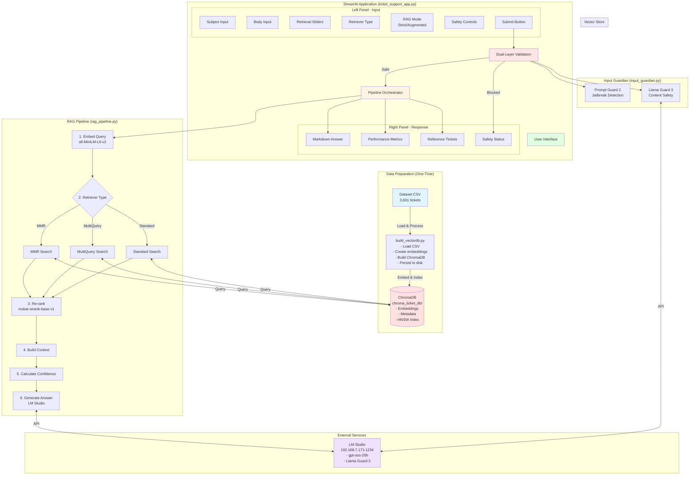
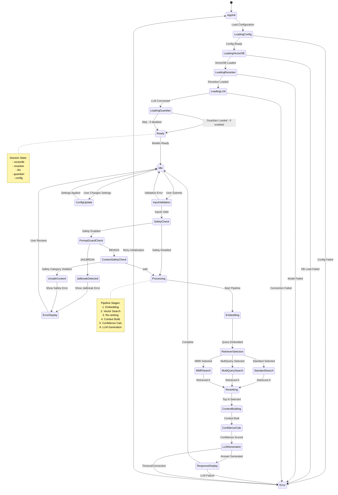
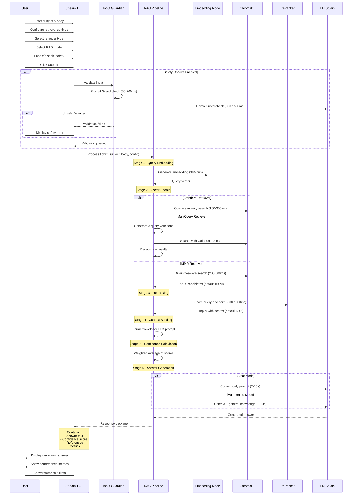
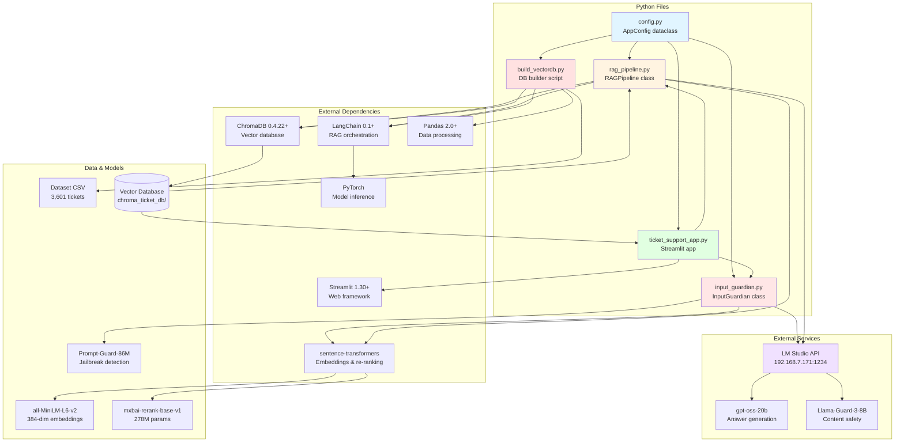

# Week07 - RAG Support Ticket System Design

## System Overview

A production-ready Streamlit application that provides intelligent support ticket resolution using LangChain, ChromaDB vector database, and two-stage retrieval with re-ranking.

### Architecture Components



## Component Design

### 1. Vector Database Builder (`build_vectordb.py`)

**Purpose**: One-time setup script to create and populate the ChromaDB vector database with all available tickets.

**Responsibilities**:
- Load complete dataset (100% of tickets - no train/test split)
- Generate embeddings using HuggingFace model
- Create ChromaDB collection with metadata
- Persist to disk for production use

**Configuration**:
```python
CONFIG = {
    'csv_path': 'dataset-tickets-multi-lang3-4k-translated-all.csv',
    'chroma_db_path': './chroma_ticket_db',
    'collection_name': 'support_tickets',
    'embedding_model': 'sentence-transformers/all-MiniLM-L6-v2',
    'embedding_dimension': 384,
    'chunk_size': 1000,  # For batch processing
}
```

**Key Functions**:
```python
def load_tickets(csv_path: str) -> pd.DataFrame
def create_embeddings(tickets: pd.DataFrame, model: str) -> List[Document]
def build_vectordb(documents: List[Document], config: dict) -> Chroma
def validate_vectordb(vectordb: Chroma) -> dict
```

**Output**:
- ChromaDB database at `chroma_ticket_db/`
- Validation report with statistics
- Performance metrics (time, memory usage)

---

### 2. Streamlit Support App (`ticket_support_app.py`)

**Purpose**: Interactive web application for real-time ticket resolution using RAG pipeline.

#### UI Layout

```mermaid
graph LR
    subgraph "Streamlit Application - Two-Column Layout"
        subgraph "Left Panel - Ticket Input"
            HEADER1[Intelligent Support Ticket Assistant]
            SUBJECT_IN[Subject Text Input<br/>Brief description]
            BODY_IN[Body Text Area<br/>Detailed issue description]

            subgraph "Configuration Controls"
                SLIDER_K[Initial K Slider<br/>5-50 candidates]
                SLIDER_N[Reranked N Slider<br/>1-20 final results]
                RET_TYPE[Retriever Type<br/>- Standard<br/>- MultiQuery<br/>- MMR]
                RAG_MODE[RAG Mode<br/>- Strict<br/>- Augmented]
                SAFE_OPT[Safety Options<br/>- Content Safety<br/>- Prompt Injection]
                REF_OPT[Display Options<br/>- Show References<br/>- Show Metrics]
            end

            ACTIONS[Action Buttons<br/>Submit or Clear]

            HEADER1 --> SUBJECT_IN
            SUBJECT_IN --> BODY_IN
            BODY_IN --> SLIDER_K
            SLIDER_K --> SLIDER_N
            SLIDER_N --> RET_TYPE
            RET_TYPE --> RAG_MODE
            RAG_MODE --> SAFE_OPT
            SAFE_OPT --> REF_OPT
            REF_OPT --> ACTIONS
        end

        subgraph "Right Panel - AI Response"
            HEADER2[AI-Generated Response]

            subgraph "Safety Validation"
                SAFE_STATUS[Validation Status<br/>Pass or Blocked<br/>Categories shown if unsafe]
            end

            subgraph "Main Answer"
                ANSWER_MD[Markdown Rendered Answer<br/>Solution with Steps]
            end

            subgraph "Performance Metrics"
                METRIC1[Response Time<br/>2.3s]
                METRIC2[Confidence Score<br/>92%]
                METRIC3[Tickets Retrieved<br/>5 tickets]
            end

            subgraph "Reference Tickets (Expandable)"
                REF1[Ticket 1 - 95% match<br/>Subject + Body preview]
                REF2[Ticket 2 - 87% match<br/>Subject + Body preview]
                REF3[More references...]
            end

            HEADER2 --> SAFE_STATUS
            SAFE_STATUS --> ANSWER_MD
            ANSWER_MD --> METRIC1
            METRIC1 --> METRIC2
            METRIC2 --> METRIC3
            METRIC3 --> REF1
            REF1 --> REF2
            REF2 --> REF3
        end

        ACTIONS -.->|User Submits| HEADER2
    end

    style HEADER1 fill:#e1f5ff
    style HEADER2 fill:#e1ffe1
    style SAFE_STATUS fill:#ffe6e6
    style ANSWER_MD fill:#fff4e1
    style ACTIONS fill:#ffe1e1
```



#### Configuration Management

**Flexible Config System**:
```python
class AppConfig:
    """Centralized configuration with extensibility for future options"""

    # Vector Database
    chroma_db_path: str = './chroma_ticket_db'
    collection_name: str = 'support_tickets'

    # Embedding
    embedding_model: str = 'sentence-transformers/all-MiniLM-L6-v2'

    # Retrieval
    top_k_initial: int = 20
    top_k_reranked: int = 5
    reranker_model: str = 'mixedbread-ai/mxbai-rerank-base-v1'

    # LLM
    lm_studio_url: str = 'http://192.168.7.171:1234'
    llm_model: str = 'gpt-oss-20b'
    max_tokens: int = 6000
    temperature: float = 0.1

    # RAG Modes
    rag_mode: str = 'strict'  # 'strict' or 'augmented'

    # UI Options
    show_references: bool = True
    show_metrics: bool = True

    # Future extensibility
    extra_options: dict = field(default_factory=dict)
```

#### State Management



**Session State Structure**:
```python
# Initialize session state
if 'vectordb' not in st.session_state:
    st.session_state.vectordb = load_vectordb()

if 'reranker' not in st.session_state:
    st.session_state.reranker = load_reranker()

if 'llm' not in st.session_state:
    st.session_state.llm = init_llm()

if 'guardian' not in st.session_state:
    st.session_state.guardian = init_guardian()

if 'config' not in st.session_state:
    st.session_state.config = AppConfig()
```

#### RAG Pipeline Implementation



**Core Pipeline Functions**:
```python
def embed_query(query: str, embedder: HuggingFaceEmbeddings) -> List[float]:
    """Generate embedding for user query"""
    pass

def vector_search(
    query_embedding: List[float],
    vectordb: Chroma,
    top_k: int
) -> List[Document]:
    """Initial vector similarity search"""
    pass

def rerank_results(
    query: str,
    documents: List[Document],
    reranker: CrossEncoder,
    top_k: int
) -> List[Tuple[Document, float]]:
    """Re-rank results using cross-encoder"""
    pass

def build_context(
    documents: List[Tuple[Document, float]],
    mode: str
) -> str:
    """Build LLM context from retrieved tickets"""
    pass

def generate_answer(
    query: str,
    context: str,
    llm: ChatOpenAI,
    mode: str
) -> dict:
    """Generate answer using LLM with context"""
    # Returns: {
    #   'answer': str,
    #   'confidence': float,
    #   'references': List[dict],
    #   'metadata': dict
    # }
    pass
```

**LangChain Integration**:
```python
from langchain_openai import ChatOpenAI
from langchain_community.embeddings import HuggingFaceEmbeddings
from langchain_chroma import Chroma
from langchain.prompts import ChatPromptTemplate
from langchain.schema.output_parser import StrOutputParser
from langchain.schema.runnable import RunnableLambda
from sentence_transformers import CrossEncoder

def create_rag_chain(config: AppConfig):
    """Create LangChain RAG pipeline"""

    # Build prompt template based on mode
    if config.rag_mode == 'strict':
        system_prompt = """You are a technical support assistant.
        Answer ONLY based on the provided historical ticket context.
        If the context doesn't contain relevant information, say so.

        Historical Tickets:
        {context}
        """
    else:  # augmented
        system_prompt = """You are a technical support assistant.
        Use the provided historical tickets as primary reference,
        but supplement with your IT knowledge when helpful.

        Historical Tickets:
        {context}
        """

    prompt = ChatPromptTemplate.from_messages([
        ("system", system_prompt),
        ("user", "Subject: {subject}\n\nBody: {body}\n\nProvide a detailed solution.")
    ])

    # Build chain
    chain = (
        {
            "context": RunnableLambda(lambda x: x["context"]),
            "subject": RunnableLambda(lambda x: x["subject"]),
            "body": RunnableLambda(lambda x: x["body"])
        }
        | prompt
        | llm
        | StrOutputParser()
    )

    return chain
```

#### Performance Metrics

**Tracked Metrics**:
```python
@dataclass
class PerformanceMetrics:
    """Response performance tracking"""

    # Timing
    total_time: float
    embedding_time: float
    search_time: float
    rerank_time: float
    llm_time: float

    # Quality
    confidence_score: float
    num_retrieved: int
    num_reranked: int

    # Metadata
    timestamp: datetime
    rag_mode: str

    def to_dict(self) -> dict:
        """Convert to dictionary for display"""
        return {
            'Total Response Time': f"{self.total_time:.2f}s",
            'Vector Search': f"{self.search_time:.2f}s",
            'Re-ranking': f"{self.rerank_time:.2f}s",
            'LLM Generation': f"{self.llm_time:.2f}s",
            'Confidence': f"{self.confidence_score:.1%}",
            'Tickets Retrieved': self.num_retrieved,
            'Mode': self.rag_mode.capitalize()
        }
```

#### UI Component Functions

**Left Panel - Input**:
```python
def render_input_panel():
    """Render ticket input section"""
    st.header("📝 Ticket Input")

    subject = st.text_input(
        "Subject",
        placeholder="Brief description of the issue",
        help="Enter a concise subject line for your support request"
    )

    body = st.text_area(
        "Body",
        height=200,
        placeholder="Detailed description of your issue...",
        help="Provide as much detail as possible to get accurate assistance"
    )

    st.subheader("⚙️ Options")

    rag_mode = st.radio(
        "RAG Mode",
        options=['strict', 'augmented'],
        format_func=lambda x: {
            'strict': '🔒 Strict (Context Only)',
            'augmented': '🔓 Augmented (+ LLM Knowledge)'
        }[x],
        help="Strict: Answer only from historical tickets | Augmented: Supplement with LLM knowledge"
    )

    show_references = st.checkbox(
        "Show Reference Tickets",
        value=True,
        help="Display the historical tickets used to generate the answer"
    )

    col1, col2 = st.columns(2)
    with col1:
        submit = st.button("Submit", type="primary", use_container_width=True)
    with col2:
        clear = st.button("Clear", use_container_width=True)

    return {
        'subject': subject,
        'body': body,
        'rag_mode': rag_mode,
        'show_references': show_references,
        'submit': submit,
        'clear': clear
    }
```

**Right Panel - Response**:
```python
def render_response_panel(response: dict, metrics: PerformanceMetrics, show_references: bool):
    """Render AI-generated response section"""
    st.header("💡 AI-Generated Response")

    # Main answer
    st.markdown(response['answer'])

    # Performance metrics
    st.divider()

    col1, col2, col3 = st.columns(3)
    with col1:
        st.metric("⏱️ Response Time", f"{metrics.total_time:.2f}s")
    with col2:
        st.metric("📊 Confidence", f"{metrics.confidence_score:.1%}")
    with col3:
        st.metric("🔍 Retrieved", metrics.num_retrieved)

    # Reference tickets (expandable)
    if show_references and response.get('references'):
        with st.expander("📚 Reference Tickets", expanded=False):
            for i, ref in enumerate(response['references'], 1):
                st.markdown(f"**Ticket #{i}** (Match: {ref['score']:.1%})")
                st.text(f"Subject: {ref['subject']}")
                st.text_area(
                    f"Content {i}",
                    value=ref['body'],
                    height=100,
                    disabled=True,
                    label_visibility="collapsed"
                )
                st.divider()
```

## Component Dependencies



## File Structure

```
Week07/
├── 📄 Documentation
│   ├── DESIGN.md                       # This document - system design
│   ├── ARCHITECTURE.md                 # Architecture diagrams
│   ├── README.md                       # User documentation
│   └── Week07_Presentation.md          # Classroom slides
│
├── 🐍 Core Application Files (Fully Documented)
│   ├── config.py                       # Configuration management
│   ├── input_guardian.py               # Dual-layer safety validation
│   ├── rag_pipeline.py                 # RAG pipeline components
│   ├── ticket_support_app.py           # Main Streamlit application
│   └── build_vectordb.py               # Vector DB builder script
│
├── 📦 Dependencies
│   ├── requirements.txt                # Python dependencies
│   └── secrets.env                     # API keys (gitignored)
│
├── 💾 Data Files
│   ├── dataset-tickets-multi-lang3-4k-translated-all.csv
│   ├── dataset-tickets-multi-lang3-4k.csv
│   └── chroma_ticket_db/               # Vector database (gitignored)
│
└── 🧪 Tests (Future)
    ├── test_config.py
    ├── test_input_guardian.py
    ├── test_rag_pipeline.py
    └── test_app.py
```

## Dependencies

```txt
# Core
streamlit>=1.30.0
pandas>=2.0.0
python-dotenv>=1.0.0

# LangChain Ecosystem
langchain>=0.1.0
langchain-openai>=0.0.5
langchain-community>=0.0.20
langchain-chroma>=0.1.0

# Vector DB & Embeddings
chromadb>=0.4.22
sentence-transformers>=2.3.0

# LLM Integration
openai>=1.10.0  # OpenAI-compatible API
requests>=2.31.0
```

## Implementation Phases

### Phase 1: Vector Database Builder
- ✅ Load complete CSV dataset
- ✅ Create embeddings for all tickets
- ✅ Build ChromaDB with metadata
- ✅ Validation and statistics

### Phase 2: Core RAG Pipeline
- ✅ Query embedding
- ✅ Vector search implementation
- ✅ Re-ranking with cross-encoder
- ✅ Context building
- ✅ LLM answer generation

### Phase 3: Streamlit UI
- ✅ Two-column layout
- ✅ Input forms (subject/body)
- ✅ Response rendering (markdown)
- ✅ Performance metrics display
- ✅ Reference ticket display

### Phase 4: Configuration & Extensibility
- ✅ Flexible config system
- ✅ RAG mode toggle (strict/augmented)
- ✅ Session state management
- ✅ Error handling

### Phase 5: Polish & Documentation
- ✅ Loading indicators
- ✅ Error messages
- ✅ User help text
- ✅ README documentation

## Configuration Options (Extensible)

**Current Options**:
- `rag_mode`: strict | augmented
- `show_references`: boolean
- `show_metrics`: boolean

**Future Options** (easily added via `extra_options` dict):
- `enable_evaluation`: boolean - Show LLM-as-judge quality scores
- `search_filters`: dict - Metadata filtering (category, priority, language)
- `temperature`: float - LLM temperature control
- `top_k_slider`: boolean - Allow user to adjust retrieval count
- `export_format`: str - Export answer (PDF, markdown, HTML)
- `feedback_enabled`: boolean - Thumbs up/down rating system
- `model_selection`: str - Choose different LLM models
- `embedding_model`: str - Switch embedding models

## Performance Targets

- **Initial Load**: < 5 seconds (one-time ChromaDB + model loading)
- **Query Response**: 2-5 seconds total
  - Embedding: < 0.1s
  - Vector Search: < 0.5s
  - Re-ranking: < 0.5s
  - LLM Generation: 1-4s (depends on LM Studio)
- **Memory Usage**: < 2GB (embeddings + reranker + ChromaDB)

## Error Handling

**Graceful Degradation**:
```python
try:
    # Attempt re-ranking
    reranked = rerank_results(query, initial_results, reranker)
except Exception as e:
    st.warning("Re-ranking unavailable, using vector search results only")
    reranked = initial_results[:config.top_k_reranked]

try:
    # Attempt LLM generation
    answer = generate_answer(query, context, llm)
except Exception as e:
    st.error(f"LLM generation failed: {str(e)}")
    answer = {
        'answer': "Unable to generate answer. Please try again.",
        'error': str(e)
    }
```

## Security Considerations

- ✅ API keys in `.env` file (gitignored)
- ✅ Input validation and sanitization
- ✅ No raw SQL or code execution
- ✅ LM Studio on local network (no external API calls)
- ⚠️ Rate limiting (future: implement if needed)
- ⚠️ User authentication (future: if multi-user deployment)

## Testing Strategy

**Unit Tests** (`tests/test_rag_pipeline.py`):
- Embedding generation
- Vector search accuracy
- Re-ranking correctness
- Context building

**Integration Tests** (`tests/test_app.py`):
- End-to-end pipeline
- Config validation
- Error handling

**Manual Testing Checklist**:
- [ ] Submit valid ticket → receives answer
- [ ] Submit empty ticket → validation error
- [ ] Toggle strict/augmented → different responses
- [ ] Show/hide references → UI updates
- [ ] ChromaDB unavailable → error message
- [ ] LM Studio down → graceful degradation

## Deployment Notes

**Local Development**:
```bash
# 1. Build vector database
python build_vectordb.py

# 2. Run Streamlit app
streamlit run ticket_support_app.py
```

**Production Considerations**:
- Use persistent ChromaDB storage
- Configure LM Studio for high availability
- Implement logging and monitoring
- Add caching for frequent queries
- Consider horizontal scaling (multiple workers)

---

## Design Decisions & Rationale

### Why separate `build_vectordb.py`?
- One-time setup vs. runtime query performance
- Allows updating vector DB independently
- Clearer separation of concerns
- Easier to test and validate DB creation

### Why LangChain?
- Standardized RAG pipeline patterns
- Seamless LLM integration
- Built-in ChromaDB support
- Extensible for future enhancements

### Why two-column layout?
- Natural left-to-right workflow (input → output)
- Side-by-side comparison of ticket and answer
- Efficient use of screen space
- Industry-standard pattern (ChatGPT, Claude)

### Why dataclass for config?
- Type safety and validation
- IDE autocomplete support
- Easy serialization/deserialization
- Clear documentation of options

### Why session state for models?
- Avoid reloading models on every interaction
- Significant performance improvement
- Maintains stateful connection to ChromaDB
- Streamlit best practice for expensive resources

---

## Next Steps

1. **Implement `config.py`** - Configuration management system
2. **Implement `rag_pipeline.py`** - Extract pipeline from notebook
3. **Implement `build_vectordb.py`** - Vector database builder
4. **Implement `ticket_support_app.py`** - Streamlit application
5. **Create `requirements.txt`** - Dependency specification
6. **Write `README.md`** - User documentation
7. **Test end-to-end** - Validate complete workflow
